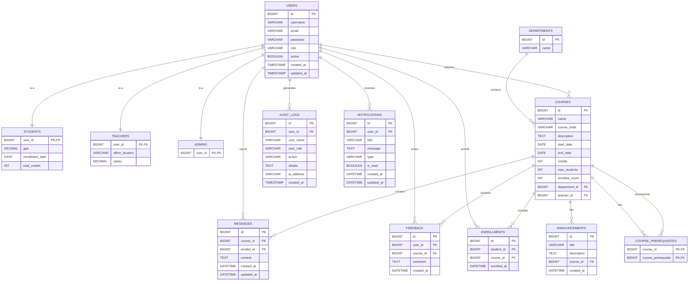

## Entity Relationship Diagram

This diagram represents the logical data model across all microservices (`iam-service`, `academic-core-service`, `communication-service`).

```mermaid
  erDiagram

    USERS {
        BIGINT id PK
        VARCHAR username
        VARCHAR email
        VARCHAR password
        VARCHAR role
        BOOLEAN active
        TIMESTAMP created_at
        TIMESTAMP updated_at
    }

    STUDENTS {
        BIGINT user_id PK, FK
        DECIMAL gpa
        DATE enrollment_date
        INT total_credits
    }

    TEACHERS {
        BIGINT user_id PK, FK
        VARCHAR office_location
        DECIMAL salary
    }

    ADMINS {
        BIGINT user_id PK, FK
    }

    DEPARTMENTS {
        BIGINT id PK
        VARCHAR name
    }

    COURSES {
        BIGINT id PK
        VARCHAR name
        VARCHAR course_code
        TEXT description
        DATE start_date
        DATE end_date
        INT credits
        INT max_students
        INT enrolled_count
        BIGINT department_id FK
        BIGINT teacher_id FK
    }

    COURSE_PREREQUISITES {
        BIGINT course_id PK, FK
        BIGINT course_prerequisite PK, FK
    }

    ENROLLMENTS {
        BIGINT id PK
        BIGINT student_id FK
        BIGINT course_id FK
        DATETIME enrolled_at
    }

    ANNOUNCEMENTS {
        BIGINT id PK
        VARCHAR title
        TEXT description
        BIGINT course_id FK
        DATETIME created_at
    }

    FEEDBACK {
        BIGINT id PK
        BIGINT user_id FK
        BIGINT course_id FK
        TEXT comment
        DATETIME created_at
    }

    AUDIT_LOGS {
        BIGINT id PK
        BIGINT user_id FK
        VARCHAR user_name
        VARCHAR user_role
        VARCHAR action
        TEXT details
        VARCHAR ip_address
        TIMESTAMP created_at
    }

    NOTIFICATIONS {
        BIGINT id PK
        BIGINT user_id FK
        VARCHAR title
        TEXT message
        VARCHAR type
        BOOLEAN is_read
        DATETIME created_at
        DATETIME updated_at
    }

    MESSAGES {
        BIGINT id PK
        BIGINT course_id FK
        BIGINT sender_id FK
        TEXT content
        DATETIME created_at
        DATETIME updated_at
    }

    USERS ||--|| STUDENTS : "is a"
    USERS ||--|| TEACHERS : "is a"
    USERS ||--|| ADMINS : "is a"

    DEPARTMENTS ||--o{ COURSES : contains
    USERS ||--o{ COURSES : teaches

    COURSES ||--o{ COURSE_PREREQUISITES : has
    COURSES ||--o{ COURSE_PREREQUISITES : prerequisite

    USERS ||--o{ ENROLLMENTS : enrolls
    COURSES ||--o{ ENROLLMENTS : includes

    COURSES ||--o{ ANNOUNCEMENTS : has

    USERS ||--o{ FEEDBACK : writes
    COURSES ||--o{ FEEDBACK : receives

    USERS ||--o{ AUDIT_LOGS : generates

    USERS ||--o{ NOTIFICATIONS : receives

    USERS ||--o{ MESSAGES : sends
    COURSES ||--o{ MESSAGES : contains
```
