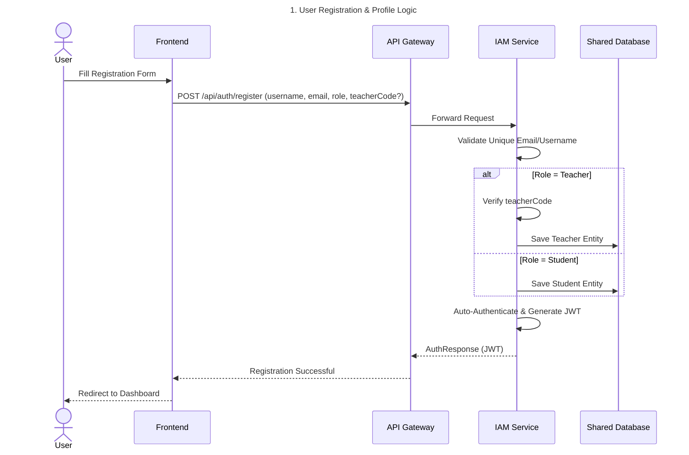
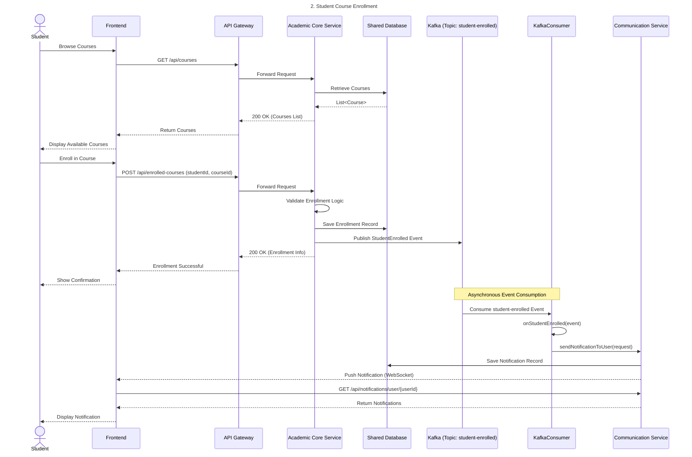
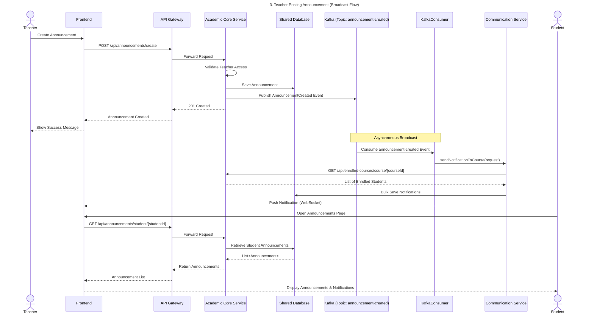

## 1. User Authentication (Login)
This flow handles secure user authentication and JWT generation.

## 2. Student Course Enrollment 
This use case demonstrates asynchronous communication using Kafka for notifications.

## 3. Teacher Posting Announcement (Broadcast Flow)
Demonstrates broadcasting updates to multiple recipients via events.

